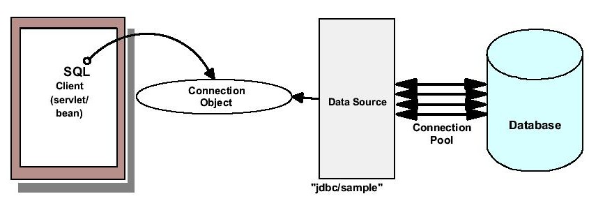

# JDBC技术

> JDBC技术：Java数据库连接（Java DataBase Connectivity）
>
> 代码来自“onlineStockWeb02”

## JDBC技术

- ODBC技术：开放式数据库连接
- 使用针对于数据库的驱动程序，提供一组用于访问任何数据库的API

## JDBC驱动程序

- JDBC规范支持的产品：把基于JDBC的应用程序中的调用规则映射为针对于数据库的正确调用
- 访问某类型的数据库必须要使用该数据库特有的JDBC驱动程序
- 由数据库供应商提供

## JDBC API

- 把Java语句转换成SQL语句的API
- 由一组类和接口定义的方法构成，为Java开发人员提供了一个行业标准API

## JDBC技术的调用过程

1. Java程序调用JDBC接口中的方法
2. JDBC驱动程序将调用转换为数据库可以理解的形式
3. （数据库执行操作，）JDBC从数据库获得结果，并把结果转换成JDBC接口中的类
4. Java程序得到结果集

这样的过程封装了数据库操作，使得开发人员只需要了解一组API就可以访问任何关系型数据库。不用为不同的数据库重新编写代码。

## 使用JDBC读取数据

- 建立数据库连接（DriverManager机制或者DataSource机制）
- 向数据库发送请求
- 数据库查询结果
- 处理结果
- 断开连接

## JDBC驱动程序的类型

### JDBC-ODBC桥

- 把JDBC API映射成ODBC API，借用现有的ODBC驱动程序
- 优点：允许访问几乎所有数据库
- 缺点：性能比较慢；丧失了Java的跨平台性；不能在web应用中使用；不适合大型应用程序

### Native-API Partly Java

- 把JDBC API映射成针对数据库客户端API
- 优点：性能比较好
- 缺点：需要为每台客户端安装特定的数据库文件/协议

### Net-Protocol Fully Java

- 把JDBC调用转化成与DBMS无关的网络协议，再由中间层服务器转化成DBMS使用的协议
- 优点：不需要在客户机上安装数据库软件，可移植性比较好
- 缺点：数据来自服务器，查看数据集比较慢

### Native-protocol Fully Java

- 纯Java，把Java语句转换成DBMS协议
- 比Net-Protocol Fully Java快，应用于web程序中
- 与平台无关

## DriverManager机制

### 步骤

1. 注册驱动程序
   - 隐式注册：`Class.forName("JDBCDriverName")`;
   - 显式注册：`DriverManager.registerDriver (new JDBCDriverName())`;
2. 建立数据库连接：`Connection con = DriverManager.getConnection(URL,username,password)`;
3. 使用使用连接进行查询和修改操作

### 弊端

- 同步，一个线程只能运行一个
- 数据库相关属性在类中，如果客户要更换服务器，就要重新编译部署
- 用户的用户名和密码都明文写在代码中了

## DataSource机制-连接池


### 步骤

1. 查询数据源对象

```java
jndiContext = new InitialContext(properties);
datasource = (DataSource) jndiContext.lookup("java:comp/env/jdbc/onlinestock");
```

2. 获取数据库连接

```java
connection = datasource.getConnection();
```

3. 进行数据库操作（和上面的一样）

### 好处
- 连接到数据库的方式需要通信，内存，授权等来创建连接，并且对于访问站点的每一个客户都创建了一条连接，代价比较高
- 连接池的方式并不会创建新的连接，而是重用连接
- 允许共享的数据库连接，并不会为每个用户创建链接
- 借助连接池可以对连接到数据库的数量进行控制


## 与数据库交互

通过`java.sql.Statement`完成

```java
stmt = connection.createStatement();
stmt.excute("任何有效sql语句")
result = stmt.executeQuery();
```

### 准备处理语句

```java
PreparedStatement pstmt = connection.prepareStatement("select stockid from mystock where userid='zhangsan'");
result = pstmt.executeQuery();
```

### 通配符

```java
PreparedStatement pstmt = connection.prepareStatement("select stockid from mystock where userid=？");
pstmt.setString(1, (String) req.getAttribute("login"));
result = stmt.executeQuery();
```

### 元数据

`ResultSetMetaData`:结果集的结构信息，包括列名，列的数量等等

```java
ResultSetMetaData rsmd=rs.getMetaData();
rsmd.getColumnCount();
rsmd.getColumnName(index);
```

### ResultSet类

## 数据库的事务性

## JDBC最佳事务性

- 查询更准确：SQL语句好好写
- 调整数据库参数位置：适当的数据库缓冲策略
- 把初始化过程放在init中只执行一次
- 使用批量更新
- 尽可能做现场更新：使用update而不是insert，delete，remove
- 使用适当的办法获得数据库连接：DataSource
- 适当的释放连接资源：final子句释放connection资源
- 不要闲置JDBC连接
- 尽快的提交或者回滚事务
- 控制连接池容量
- 尽可能利用数据库的功能

