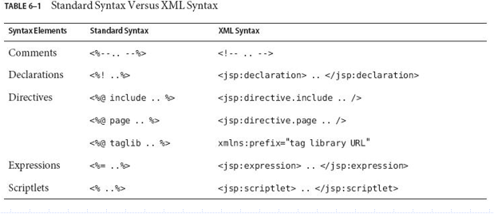

# JSP

## JSP技术

> JSP技术让你更容易地创建网页内容，它可以包含动态和静态两部分内容

- JSP技术的主要特点包括
  - 描述了一个web请求是如何变成web响应的
  - 用于访问服务器的表达式语言
  - 定义了JSP语言的扩展机制
- 什么是JSP页面
  - JSP页面是一个包含两种类型文本的文本文档。一种是静态数据，包括html，xml，svg等。另一种被称为JSP元素
  - JSP页面的扩展名是`.jsp`
  - JSP元素的组织形式可以有两种语法：标准语法和xml语法，尽管任何JSP页面只能用其中的一种语法。

```jsp
<html>
  	<head>
		<title>Hello World</title>
	</head>
	<body>
		<%
			out.print("<p><b>Hello World!</b>");
		%>
	</body>
</html>

```

- JSP的生命周期

  1. 当客户第一次请求JSP页面时，JSP引擎会通过预处理把JSP文件中的静态数据（HTML文本）和动态数据（Java脚本）全部转换为Java代码。这个转换工作实际上是非常直观的，对于HTML文本只是简单的用out.println()方法包裹起来，对于Java脚本只是保留或做简单的处理。
  2. JSP引擎把生成的.java文件编译成Servlet类文件（.class）。对于Tomcat服务器而言，生成的类文件默认的情况下存放在\<Tomcat\>\work目录。
  3. 编译后的class对象被加载到容器中，并根据用户的请求生成HTML格式的响应页面。

  > 也就是说，虽然jsp页面看起来很像是html页面，但是实际上它先被编译成Servlet类，之后被输出

- JSP技术的优点：加速了创建动态和个性化内容的web应用的过程

  - 程序开发组：编写业务逻辑和表示业务逻辑方面的代码
  - web页面设计组：建立html页面

- JSP技术的缺点

  - 如果某JSP页面有所调整，下一个对该页面的请求会触发重编译——请求慢
  - 只有运行时才能发现页面中的一些错误

## JSP文档

- JSP文档是任何以xml格式编写的jsp页面
- JSP文档一般以`.jspx`作为扩展名
- 因为这种JSP文档也是一种xml文档，所以你可以享受任何xml文档具有的好处



```jsp
<jsp:root xmlns:jsp="http://java.sun.com/JSP/Page" version="2.0" >
<html>
<head>
<title>Hello World</title>
</head>
<body>
<jsp:scriptlet>
out.print("Hello World!");
</jsp:scriptlet>
</body>
</html>
</jsp:root>

```

