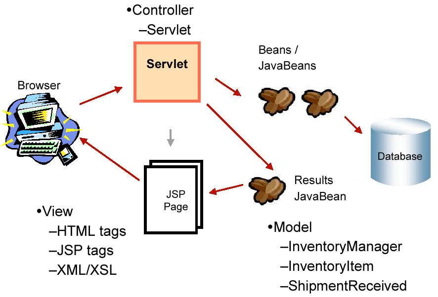
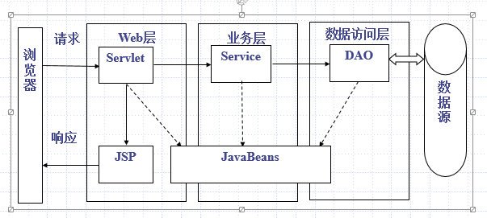

# MVC

## MVC

- 很多复杂应用需要几种不同方式查看和操作数据，对数据显示的任何修改，都需要在相关位置进行
- 当数据操作逻辑、格式化和显示代码同用户事件处理混杂在一起的时候，应用维护变得非常困难，特别是在时间跨度非常大的情况下
- 如果应用逻辑已经同现有界面的代码混合在一起，用户界面就不能被重新利用
- 增加功能要求对现有的代码进行多处修改，而这些需要修改的位置很难发现
- 对单独一段代码进行修改会造成深远的副作用
- Web应用具有非常复杂的用户交互模型：若干不同的表单向同一个页面发送数据，或同一个表单中的数据需要发送到不同的页面中
- Web应用需要支持国际化语言环境，且具有许多不同的视图

## 实现方式

- 模型：封装应用数据（关系数据库或EJB），处理商业逻辑

- 视图：呈现给用户的界面（JSP或应用GUI）

- 控制器：接受用户动作，并对应用数据进行适当的处理（Servlet）

## 执行过程

1. 客户端在浏览器发出请求

2. Servlet截获请求

3. Servlet决定哪个组件（JavaBeans, EJBs 或者其他的组件）来解决这个请求

4. JavaBeans or EJBs为Servlet提供业务逻辑方法并把结果封装

5. Servlet确定一个表现形式（JSP）来把结果发送给用户

6. JSP从javaBeans那里获得特定的响应

