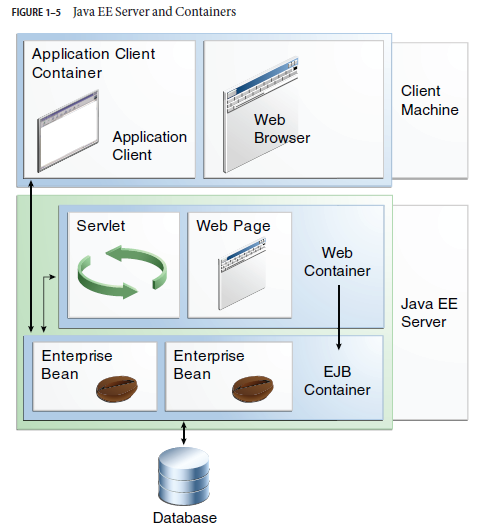

# JavaEE概述

## JavaEE

Java Platform,Enterprise Edition

企业版本的Java应用开发平台

## Enterprise application

- 开发者意识到他们需要**分布式的，事务性的，便携式**的应用程序。这些应用程序必须要有一定规模的速度，安全的和可靠的服务器
- 企业级应用为每个企业提供了业务逻辑

## Overview

- JavaEE平台的目的是提供开发者一组功能强大的api,同时减少开发时间,减少应用程序的复杂性,并提高应用程序的性能。
- JavaEE平台使用了一种简化的编程模型
  - 具有更多的注释，更少的xml配置
  - 使用更多普通的Java对象，简化包设计

## JavaEE应用模型

- 开始于Java编程和Java虚拟机
- Java提供的可靠的可移植性、安全性和开发人员的生产力构成了应用模型的基础
- JavaEE应用模型提供了一个架构。这个架构用于实现多层的，可伸缩的，可访问的企业级应用
- 这个模型把一个实现一个多层服务需要的工作分成不同的部分。

## 分布式多层应用

- JavaEE平台为企业应用开发提供了分布式多层应用模型
- 根据应用内容，应用逻辑被分成不同的组成部分。这样的话，一个JavaEE应用可能被装在不同的机器上

## 安全性

JavaEE平台提供了登录机制

## JavaEE组成部分

JavaEE定义了以下的组成部分

- 客户端应用：html，xml等
- Java Servlet, JavaServer Faces和JavaServerPages（JSP）：在服务器上运行的web部分
- EJB（Enterprise Java Beans）：在服务器上运行的业务部分

## 总结

ppt上啰里啰嗦太多了，以下是网友的总结

http://www.cnblogs.com/pugang/p/4619912.html

JavaEE：**JVM + API +大规模+多层的+可扩展的+可靠+安全+网络 的应用程序**，其核心是**网络**

