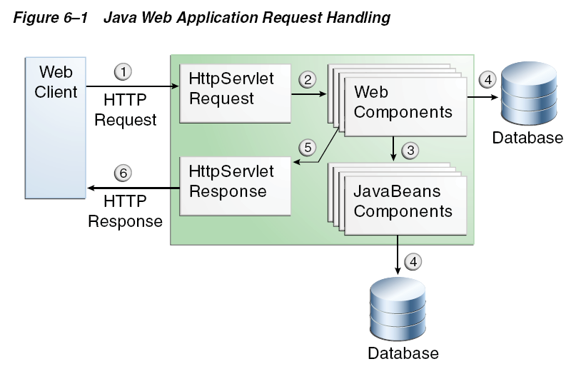

# Servlet技术

## Web应用

web应用程序是一个动态的扩展web服务器，有两种组织形式

- 面向表示的：面向表示的web应用生成交互式的web页面，包括各种标记语言
- 面向服务的：面向服务的web应用是一个web服务的端点

## Web组件

- 在J2EE平台上，web组件给web服务器提供了动态扩展的能力
- web组件包括：**servlets,web pages,JSP pages**

## Web请求处理过程

1. 客户端向服务器发送一个**http request**
2. 一个继承了JavaSevelet的服务接受了这个请求，并把这个请求转换成一个**HTTPServletRequest Object**
3. 这个object将会被交付给某个**web组件**，这个组件可以和**javaBeans组件**或者**数据库**进行交流
4. 这些web组件将会返回一个**HttpServletResponse**或者把请求发送给另个web组件
5. 某个web组件最终会返回一个HttpServletResponse
6. web服务器把HttpServletResponse转换成**http response**并把它返回给客户端

下图显示了大部分的请求处理过程:



## Web容器

- web组件需要web容器的支持
- web容器为web组件提供了一系列服务，包括请求，安全性，实时性，生命线管理
- web容器同时为web组件提供接口
- web应用由web组件，资源文件和helper类以及类库组成。web容器扩展了web组件的能力

## 开发Web应用

1. 开发web组件
2. 开发配置描述，如果有必要的话（web.xml）
3. 编译web组件以及helper类
4. 把web组件放入配置单元里（可选）
5. 把应用配置进入web容器中
6. 确定入口url

> 以上全是瞎写，下面进入servlet技术正题

## Servlet技术

- Java servlet技术是一切Java Web技术的基础
- servlet是一种Java编程语言的类，它用于扩展承载应用的请求响应模型的服务器的功能
- 尽管servlet可以用来相应任何请求，它们通常用来扩展web应用，对于这些应用来说，Java Servlet技术决定了它们的HTTP-specific servlet 类

## Http协议

- Hyper Text Transfer Protocal：超文本传输协议，是web标准通信协议
- 采用请求相应模型

### Http请求

- 任何一个http请求都包括一个方法，一个请求url，头文件和body文件
- 请求方法包括：**GET**,**POST**,HEAD,PUT,DELETE,OPTIONS,TRACE
- 请求url可以包括以下内容：http://[host]:[port]\[request-path]\?[query-string]
- request-path包括context路径（/应用名），servlet路径，路径信息，这三种信息有分别的get方法可以获取
- query-string是由参数和值组成的

### Http响应

- 任何一个http响应都包括一个结果码，头文件和body文件
- 结果码
  - 404：请求的资源不可达
  - 401：请求需要通过验证
  - 500：服务器内部出错
  - 503：服务器满载无法响应
- http响应需要实现servletResponse接口

## Servlet生命线

- 生命线由web容器控制
- 当一个请求被映射到某个servlet时，web容器开始做下面的工作
  - 如果这个这个servlet还不存在，那么容器将会加载这个servlet进入，构造一个servlet实例，并执行servlet的init方法
  - 接着执行服务方法，接受请求并返回响应
- 如果web容器需要移除一个servlet，它会执行servlet的destroy方法

## 如何编写一个Servlet

1. 使用`@WebServlet annotation`来映射路由和servlet关系，这样的话这个servlet必须继承自`javax.servlet.http.HttpServlet class`

```java
@WebServlet("/ShowMyStockServlet")
public class ShowMyStockServlet extends HttpServlet {
  //...
}
```


2. 初始化servlet：重写init函数

```java
	public void init() {
		InitialContext jndiContext = null;

		Properties properties = new Properties();
		properties.put(javax.naming.Context.PROVIDER_URL, "jnp:///");
		properties.put(javax.naming.Context.INITIAL_CONTEXT_FACTORY, "org.apache.naming.java.javaURLContextFactory");
		try {
			jndiContext = new InitialContext(properties);
			datasource = (DataSource) jndiContext.lookup("java:comp/env/jdbc/onlinestock");
			System.out.println("got context");
			System.out.println("About to get ds---ShowMyStock");
		} catch (NamingException e) {
			// TODO Auto-generated catch block
			e.printStackTrace();
		}

	}
```

3. 构造服务方法：重写post，get等方法

```java
	protected void doGet(HttpServletRequest request, HttpServletResponse response)
			throws ServletException, IOException {
		processRequest(request, response);
	}
	protected void doPost(HttpServletRequest request, HttpServletResponse response)
			throws ServletException, IOException {
		processRequest(request, response);
	}
```
- 如何写一个http响应
  - 从response中获取输出流
  - 定义输出流的头文件
  - 在输出流中编写任何想要的body
- 如何从http请求中获取数据
  - 参数：`getParameters(String key)`
  - 对象类型的属性：`getAttribute（String key）`