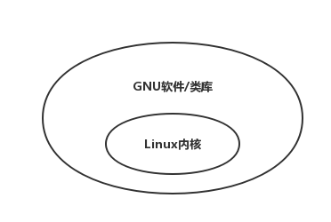
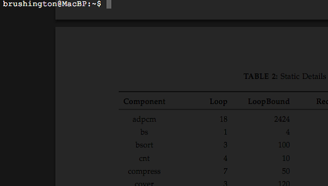
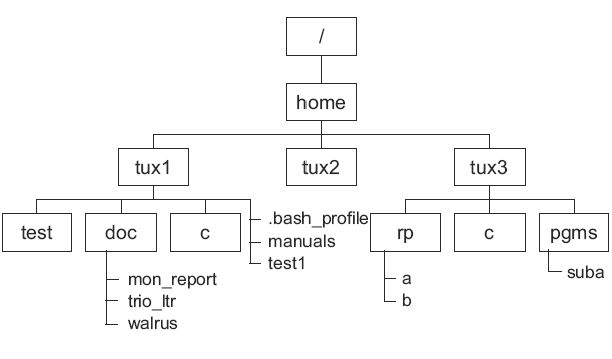
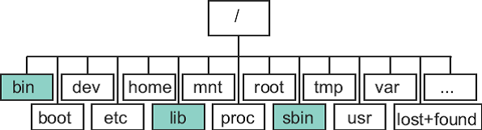
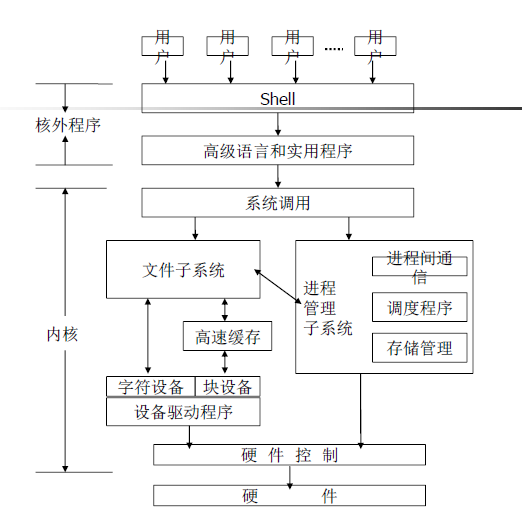

# Linux基础

[TOC]

## 1 什么是Linux

### 1.1 定义

一套免费使用和自由传播的类Unix操作系统，它是在GNU General Public License协议下发展的。

GNU计划：通用公共许可证，目标是创建一套完全自由的操作系统。

关键字：**开源，流行，支持几乎所有可用的平台**

### 1.2 简要历史

### 1.3 Linux和Unix

GNU/Linux系统包括两块：Linux内核和GNU软件/类库



贡献者包括：Red Hat, Debain, SuSe, Mandrake, Redfla

### 1.4 Linux的特殊性

- 几乎所有的软件都是符合GPL的
- 反版权（和支持版权对应）
  - 你可以任意拷贝软件
  - 你可以获得源码
  - 你可以修改源码
  - 你可以为你的工作收取费用
- 不能修改协议（GNU GPL）
- 使用了其他的自由软件协议（BSD）

### 1.5 今天的Linux

- Linux几乎覆盖了所有的计算机范围
- Linux在全世界范围内广泛使用（甚至在太空中）
- 小到家庭用户，大到世界上最大的公司，都在使用Linux

## 2 Linux的安装

###2.1 Linux安装方法

- CD安装
- 虚拟机安装

### 2.2 分区理论

- 在Intel芯片的电脑上，分区是很有必要的。
- 每个磁盘有最多4个主分区
- 一个主分区可以有多个扩展分区
- 每个扩展分区可以容纳一定的逻辑分区

### 2.3 MBR构成

- 446个字节bios
- 64个字节的主分区情况（最多4个主分区）
- 2个字节的幻数：0x55AA

### 2.4 文件系统

- 操作系统负责存取和管理文件的部分
- 文件和确定它们的属性的集合。它提供了一个名称空间的文件编号指的是那些文件

### 2.5 硬盘分区

- /分区：必要，至少750MB，推荐1.5G或以上
- Swap分区：必要，和内存一样即可
- /boot分区：推荐，16MB
- 其他可以有的分区：/home,/usr,/local,/var、
- Linux下默认的分区程序是fdisk

### 2.6 启动过程

开启电源->BIOS->boot loader->Linux内核->初始化->系统准备好

## 3 Linux的使用

### 3.1 基础知识

#### 3.1.1 命令行与图形用户界面



#### 3.1.2 Linux软件安装

- 在tarball上安装
- apt-get 命令（重要）
- dpkg
- aptitude
- yum+rpm
- RPM

#### 3.1.3 多用户和多任务

- Linux是一个多用户，多任务的操作系统
- 使用操作系统时经常需要登录
- 有很多方法可以登录

#### 3.1.4 虚拟终端

- 在许多Linux系统中，控制台提供了多个虚拟终端
- 每个虚拟终端可以被看做是一个独立的，直接附加的控制台

#### 3.1.5 Linux常用命令

ls,dir,vdir,mkdir,mknod,mkfifo,cp,rm,mv,chmod等等

### 3.2使用文件

#### 3.2.1 什么是文件

- 数据的集合
- 一个可以读取或可以写入或两者皆可的东西

#### 3.2.2 文件的结构

- 典型结构包括：字节流，记录表，记录树
- 在linux中：字节流

#### 3.2.3 文件类型

- 一般文件：text文件，代码文件，没有特定的内在结构
- 字符设备文件
- 块设备文件（二进制文件）
- 套接字文件
- 符号链接文件
- 目录文件

#### 3.2.4 目录结构






#### 3.2.5 文件权限

每个文件有三组rwx（read,write,execute）组成，分别表示拥有者，当前用户组，其他用户对该文件的权限。

root用户可以拿到任何文件的所有权限。

##### 3.2.5.1 ls -l命令

```cmd
tondiyee@tdy-linux:~$ ls a.txt -l
-rwxrwxrwx 1 tondiyee tondiyee 0 12月 16 14:08 a.txt
```

第一组10个字母：文件类型+9个权限

第二组1个数字：连接计数（后面还会涉及）

第三组和第四组：拥有者和拥有者所在用户组

第五组：文件大小（字节）

第六组：修改时间

第七组：文件名

##### 3.2.5.2 修改权限

```cmd
chmod <order> 文件名
```

- \<order\> 写成xxx：第一位8进制数字表示拥有者的权限，第二位是用户组权限，第三位是其他用户的权限
- \<order\> 写成u+w（g-x,o=x等等）：表示user，group，other添加或修改权限等等

##### 3.2.5.3 默认权限

普通文件是644（当前用户读写，其他用户只读），普通目录是755（当前用户读写执行，其他用户读执行）

目录比普通文件权限高的原因是因为目录决定了子文件的最高权限

#### 3.2.6 文件编辑

命令行：vi，emacs

图形界面：gedit

### 3.3 使用进程

进程是一个正在执行的程序实例。由执行程序、它的当前值、状态信息以及通过操作系统管理此进程执行情况的资源组成。

- 一个正在执行的程序是一个进程的例子
- 命令行本事也是一个进程，叫做shell进程，它阅读你的指令，并开始其他的命令进程（执行bin文件夹下的可执行程序）
- 进程被保存的内容：程序名，当前用户id，当前用户组id，进程id，时间，父进程id，程序变量数据，进程打开的文件，进程运行的目录。
- 所有的进程都是有其他进程创建并开启的
- 一个进程被终止的原因有两个
  - 这个进程已经做完了
  - 其他进程发送信号给这个进程使其终止
  - 命令：**ps,pstree**,jobs/fg/bg/\<ctrl+z\>,kill,nohup(忽略某些信号)，nice/renice(重新设置优先级),top

>哪种情况下会没有父进程id？
>
>linux中只有一个进程没有父进程id，那个进程是initid(ubuntu下是systemd)

## 4 Unix概述



## 5 Linux命令

### 5.1 文件操作

- 列出目录内容: ls, dir, vdir
- 创建特殊文件: mkdir, mknod, mkfifo
- 文件操作: cp, mv, rm
- 修改文件属性: chmod, chown, chgrp, touch
- 查找文件: locate, find
- 字符串匹配: grep(egrep)
- 其它: pwd, cd, ar, file, tar, more, less, head, tail,cat

### 5.2 进程操作

- ps，pstree，kill，jobs，fg，bg，nice

### 5.3 其他

- who，whoami，passwd，su，uname
- man

