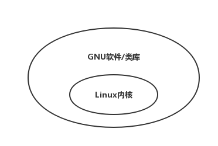

# Linux基础

[TOC]

## 1 什么是Linux

### 1.1 定义

一套免费使用和自由传播的类Unix操作系统，它是在GNU General Public License协议下发展的。

GNU计划：通用公共许可证，目标是创建一套完全自由的操作系统。

关键字：**开源，流行，支持几乎所有可用的平台**

### 1.2 简要历史

### 1.3 Linux和Unix

GNU/Linux系统包括两块：Linux内核和GNU软件/类库

贡献者包括：Red Hat, Debain, SuSe, Mandrake, Redfla

### 1.4 Linux的特殊性

- 几乎所有的软件都是符合GPL的
- 反版权（和支持版权对应）
  - 你可以任意拷贝软件
  - 你可以获得源码
  - 你可以修改源码
  - 你可以为你的工作收取费用
- 不能修改协议（GNU GPL）
- 使用了其他的自由软件协议（BSD）

### 1.5 今天的Linux

- Linux几乎覆盖了所有的计算机范围
- Linux在全世界范围内广泛使用（甚至在太空中）
- 小到家庭用户，大到世界上最大的公司，都在使用Linux

## 2 Linux的安装

###2.1 Linux安装方法

- CD安装
- 虚拟机安装

### 2.2 分区理论

- 在Intel芯片的电脑上，分区是很有必要的。
- 每个磁盘有最多4个主分区
- 一个主分区可以有多个扩展分区
- 每个扩展分区可以容纳一定的逻辑分区

### 2.3 MBR构成

- 446个字节bios
- 64个字节的主分区情况（最多4个主分区）
- 2个字节的幻数：0x55AA

### 2.4 文件系统

- 操作系统负责存取和管理文件的部分
- 文件和确定它们的属性的集合。它提供了一个名称空间的文件编号指的是那些文件

### 2.5 硬盘分区

- /分区：必要，至少750MB，推荐1.5G或以上
- Swap分区：必要，和内存一样即可
- /boot分区：推荐，16MB
- 其他可以有的分区：/home,/usr,/local,/var、
- Linux下默认的分区程序是fdisk

### 2.6 启动过程

开启电源->BIOS->boot loader->Linux内核->初始化->系统准备好

## 3 Linux的使用

## 4 Linux编程的先决条件

## 5 Linux/Unix概述

