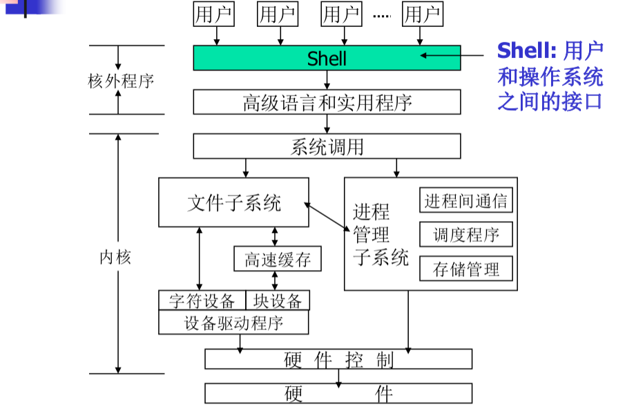
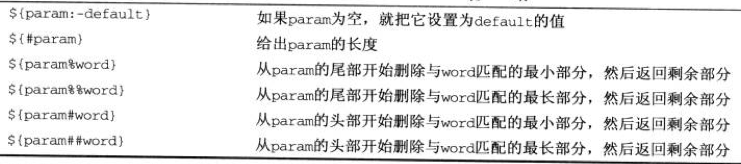

# shell编程

## 1 shell是什么



- 用户和操作系统交互的接口
- 不是内核的程序（可以卸载，当然如果你删掉了shell和图形界面，那就没有办法和linux交互）
- shell不止有一种（我们一般打开的是bash）
- shell有双重角色
  - 命令解释程序
    - 打印提示符
    - 得到命令行
    - 解析命令
    - 查找文件
    - 准备参数
    - 执行命令
  - 程序设计语言解释器

## 2 shell脚本

- 脚本可以在命令行下直接输入

```javascript
$ for file in *
>do
>if grep -l posix $file
>then
>more $file
>fi
>done
```

仅仅会执行一次，并且没有办法调试，一般不用。

- 一般方法是编写脚本文件，然后由shell执行

### 2.1 编写脚本文件

- 注释
- 退出码

```shell
#!/bin/bash
# Here is comments
for file in *; do
if grep –l POSIX $file; then
more $file
fi
done
exit 0
```

### 2.2 执行脚本文件

- 方法1：`sh script-file`
- 方法2：`chmod +x script_file (chown, chgrp optionally)   ./script_file`
- 方法3：`source script_file`

方法3和方法12的区别是：方法12中shell会新开一个子进程来执行脚本文件，而方法3会用shell本身这个进程来执行，很多时候并没有区别，但是有时会有区别

例子：

当你在脚本文件中书写了代码来修改环境变量时，用方法12并不会影响当前命令行（修改环境变量只会影响该进程和该进程的子进程，而方法12新开了子进程，所以方法12仅会影响新开的子进程及子进程的子进程），方法3会影响当前命令行。

### 2.3 用户环境

- .bash_profile, .bash_logout, .bashrc files
  - .bash_profile:登录时自动执行的脚本
  - .bash_logout:登录退出时读取执行
  - .bashrc:新开shell时读取执行
  - 主要用途：修改这些文件可以永久的修改环境变量（每次登录时都可以执行一下）；设定别名

## 3 shell编程

### 3.1 变量

#### 3.1.1 用户变量

- 用户在shell脚本里定义的变量
- 赋值和使用

```shell
var=value
#var这个变量被赋值value
echo $var
#会打印value
```

- shell脚本中没有明显的类型说法（弱类型)，可以全部认为是字符串类型
- shell脚本中等号("=")前后不能有空格，每行的末尾更不能有分号（因为shell命令解析器不能没有很强的解析功能）
- read命令：相当于c语言的scanf，等待用户输入继续执行

```shell
echo -n "Enter your name:"
read name
echo "hello $name, welcome to my program!"
exit 0

if read -t 5 -p "please enter your name:"name
then echo "hello $name, welcome to my program"
else echo "to slow"

read -n1 -p "Do you want to continue[y/n]"answer
case $answer in
Y|y)
	echo "continue"
N|n)
	echo "goodbye"
*)
	echo "error"
esac
exit 0
```

```shell
count=1#count赋值为1
cat dat| while read line
#管道，把dat这文件打开，作为read line的输入，read line的本来的意思是等待用户每次输入，赋值给line，现在是从#cat dat中读取一行，赋值给line
do 
	echo "$count:$line"
	count=(($count + 1))
done
exit 0
```

- 引号用法
  - 单引号内的所有字符都保持它本身字符的意思,而不会被bash进行解释,例如,$就是$本身而不再是bash的变量引用符;\就是\本身而不再是bash的转义字符。
  - 除了$、``(不是单引号)和\外,双引号内的所有字符将保持字符本身的含义而不被bash解释。

```shell
echo '\$PATH'
#打印\$PATH
echo \$PATH
#打印$PATH
echo $PATH
#打印PATH的值
```

#### 3.1.2 环境变量

| 环境变量  | 说明                                       |
| ----- | ---------------------------------------- |
| $HOME | 当前用户的登陆目录                                |
| $PATH | 以冒号分隔的用来搜索命令的目录清单                        |
| $PS1  | 命令行提示符,通常是”$”字符                          |
| $PS2  | 辅助提示符,用来提示后续输入,通常是”>”字符                  |
| $IFS  | 输入区分隔符。当shell读取输入数据时会把一组字符看成是单词之间的分隔符,通常是空格、制表符、换行符等。 |

#### 3.1.3 参数变量

调用脚本程序时如果带有参数,对应的参数和额外产生的一些变量，这写变量叫做参数变量

| 参数变量        | 说明                                       |
| ----------- | ---------------------------------------- |
| $#          | 传递到脚本程序的参数个数                             |
| $0          | 脚本程序的名字                                  |
| $1,2,3,...9 | 脚本程序的参数,\$10以后的变量bash下是不行的，但是有些shell是可以的，在bash下会解析为\$1+0 |
| $*          | 一个全体参数组成的清单,它是一个独立的变量,各个参数之间用环境变量IFS中的第一个字符分隔开 |
| $@          | “$*”的一种变体,它不使用IFS环境变量。                   |

### 3.2 条件测试

- 退出码
- test expression或者[ expression ]，注意这里的中括号是一个命令，也就是一定要有空格
- test支持字符串比较，算数比较，文件相关条件测试，逻辑操作

| 字符串比较       | 结果            |
| ----------- | ------------- |
| str1 = str2 | 两个字符串相同则结果为真  |
| str1!=str2  | 两个字符串不相同则结果为真 |
| -z str      | 字符串为空则结果为真    |
| -n str      | 字符串不为空则结果为真   |

| 算数比较            | 结果                      |
| --------------- | ----------------------- |
| expr1 –eq expr2 | 两个表达式相等则结果为真            |
| expr1 –ne expr2 | 两个表达式不等则结果为真            |
| expr1 –gt expr2 | expr1 大于 expr2 则结果为真    |
| expr1 –ge expr2 | expr1 大于或等于 expr2 则结果为真 |
| expr1 –lt expr2 | expr1 小于 expr2 则结果为真    |
| expr1 –le expr2 | expr1 小于或等于 expr2 则结果为真 |

| 文件条件测试  | 结果             |
| ------- | -------------- |
| -e file | 文件存在则结果为真      |
| -d file | 文件是一个子目录则结果为真  |
| -f file | 文件是一个普通文件则结果为真 |
| -s file | 文件的长度不为零则结果为真  |
| -r file | 文件可读则结果为真      |
| -w file | 文件可写则结果为真      |
| -x file | 文件可执行则结果为真     |

| 逻辑操作          | 结果       |
| ------------- | -------- |
| !expr         | 逻辑表达求反   |
| expr -a expr2 | 逻辑与（and） |
| expr -o expr2 | 逻辑或（or）  |

> tip:一般除了循环之外，代码段的开头和结束分别用正写和倒写表示（if-fi,case-esac）

#### 3.2.1 if语句

```shell
if [ expression ]
then
statements
elif [ expression ]
then
statements
elif ...
else
statements
fi
#用；连接两行可以紧凑的写
```

#### 3.2.2 case语句

```shell
case str in
str1 | str2) statements;;
str3 | str4) statements;;
*) statements;;
esac
```

### 3.3 循环语句

> tips:因为循环语句一般用done结尾，所以不用倒写结尾，而是以done结尾
>
> shell脚本一般以.sh结尾

#### 3.3.1 for循环

```shell
for var in list
do
	statements
	#statements可以var变量
done
```

> tips:shell脚本本身对浮点数没有支持
>
> $((expr)):计算expr这个表达式，计算出的结果转化成字符串
>
> $(expr):计算expr这个表达式，然后相当于\$var,可以用\`expr\`代替
>
> **有点不懂啊**

#### 3.3.2 while循环

> 看ttkp错过了不过看起来比较简单啊

#### 3.3.3 until循环

> 看ttkp错过了不过看起来比较简单啊

#### 3.3.1 select循环

> 看ttkp错过了不过看起来比较简单啊

### 3.4 命令表和语句块

#### 3.4.1命令表

- 分号串联:command1 ; command2 ;
- 条件串联:
  - and命令:statement1&&statement2&&statement3&&statement4
  - or命令:statement1||statement2||statement3||statement4

#### 3.4.2语句块

```cmd
{
statement1
statement2
...
}
{statement1; statement2 ; ... ;}
```

### 3.5 函数

#### 3.5.1形式

```shell
func(){
	statements
}
```

#### 3.5.2局部变量

- local关键字

#### 3.5.3函数调用

```shell
func param1 param2
```

#### 3.5.4 返回

```shell
return ;
```

#### 3.5.5 例子

```shell
yesno(){
	msg=“$1”
	def=“$2”
	while true; do
		echo ” ”
		echo “$msg”
		read answer
		if [ -n “$answer” ]; then
			case “$answer” in
                y|Y|yes|YES)
                return 0
                ;;
                n|N|no|NO)
                return 1
                ;;
                *)
                echo “ ”
                echo “ERROR: Invalid response,
                expected \”yes\” or \”no\”.”
                continue
                ;;
esac
		else
			return $def
		fi
	done
}
```
###3.6 杂项命令

- break: 从for/while/until循环退出
- continue: 跳到下一个循环继续执行
- exit n: 以退出码”n”退出脚本运行
- return: 函数返回
- export: 将变量导出到shell,使之成为shell的环境变量
- set: 为shell设置参数变量
- unset: 从环境中删除变量或函数
- trap: 指定在收到操作系统信号后执行的动作
- “:”(冒号命令): 空命令
- “.”(句点命令)或source: 在当前shell中执行命令
- 捕获命令输出:$(command)或者\`command\`

### 3.7 算数拓展

- $((...))扩展

### 3.8 参数扩展




### 3.9 即时文档

双小于号<<被称为即时文档,脚本文件从键盘获取输入,但输入在开始时一起输入,存于临时文档中.