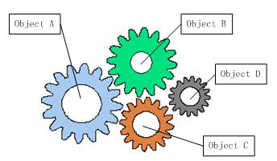
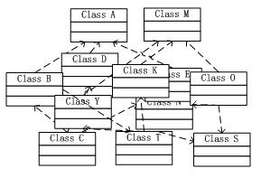
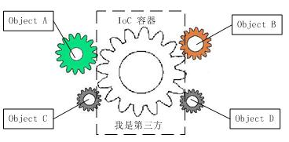

# Spring IoC机制原理

## 1. IoC理论概述

我们在座的各位同学，大部分都是以Java“起手”的面向对象程序员，那么我们都应该知道，在采用面向对象方法设计的软件系统中，它的底层实现都是由N个对象组成的，所有的对象通过彼此的合作，最终实现系统的业务逻辑。每一个对象就像下图的一个齿轮，这些齿轮彼此啮合，保证机器运转。



但是我们明显可以看出，齿轮的啮合会导致一个问题，就是一个齿轮出现问题时，会导致所有和它相关的齿轮都不能运作，这就是我们软件工程中所谓的“耦合”问题。因此我们强调要进行低耦合设计，就是要降低齿轮之间的啮合度。有许多方法可以降低对象与对象之间的耦合度，例如面相抽象设计，使用组合而不是继承等等。IoC（Inversion of Control）控制反转也是其中之一。

IoC是Spring体系的核心，它把类和类之间的依赖从代码中脱离出来，用配置的方式进行依赖管理的描述。还是用齿轮的类比的话，大概就和下图差不多。此后，Spring所有的其他功能例如AOP（面向切面编程），数据库事务管理等等都在此基础之上。



## 2. Spring中的IoC容器描述

Spring框架中，我们常说的IoC容器指的是`BeanFactory`这个接口。Bean在传统的J2EE框架中也有很多描述，在Spring中，你可以暂时地认为它就是上图中的一个一个齿轮。有很多参考资料认为IoC容器是`ApplicationConetxt`这个接口，实际上这两个接口所做的事情基本上是一样的，`BeanFactory`是Spring框架的基础设施，面向Spring本身，为Spring其他功能提供接口；而ApplicationContext面向Spring框架的使用者，大部分情况下，我们都使用`ApplicationContext`而不是前者(实际上`ApplicationContext`这个接口也继承了`BeanFactory`)。因为这里追根求底，所以下面我要说的都以`BeanFactory`为例。

## 3. IoC容器的启动

尽管Spring框架的作者是因为受不了复杂而臃肿的J2EE标准框架而编写的Spring，Spring框架不仅可以用在JavaEE中，也可以使用在普通的桌面程序中。它的实现过程有以下三种。

- 通过直接获取`BeanFactory`接口来启动

```java
    @Test
    public void TestCar() {
        ResourcePatternResolver resolver = new PathMatchingResourcePatternResolver();
        Resource res = resolver.getResource("classpath:bean1.xml");
        BeanFactory xmlBeanFactory = new XmlBeanFactory(res);

        Car car = xmlBeanFactory.getBean("car1", Car.class);
        System.out.println(car);
    }
```

- 通过直接获取`ApplicationContext`接口来启动

```java
    @Test
    public void TestCar2(){
        ApplicationContext context = new ClassPathXmlApplicationContext("bean1.xml");
        Car car = context.getBean("car1",Car.class);
        System.out.println(car);
    }
```

- 通过Web容器来自动启动，这也是大部分J2EE应用启动IoC容器的方式。下面是`web.xml`中的部分代码

```xml
<!-制定配置文件->
<context-param>
  <param-name>contextConfigLocation</param-name>
  <param-value>
  	/WEB-INF/baobaotao-dao.xml,/WEB-INF/baobaotao-service.xml
  </param-value>
</context-param>

<!-声明Web容器监听器->
<listener>
  <listener-class>org.springframework.web.context.ContextLoaderListener</listener-class>
</listener>
```

## 4. 源码分析-IoC容器的实现的Java机制

到底什么是控制反转呢？控制反转就是对象实例化的权利不在交由持有对象的那个对象，例如A持有了一个B，一般说来，A要想使用B，必须要有下面这行代码`B b = new B() `，即使使用工厂之类的模式，也只是把`new`这个关键词的使用推迟了一点，集中管理了一点，本质上还是一样的。因此都不算真正意义上的控制反转。

然而我们可能都不曾注意到，Java虚拟机中真正的对象是怎么加载的，那就是Java的反射机制。它可以用程序化的方法来实例一个对象。Spring IoC容器就是利用了这个特性，利用配置文件的信息，绕过`new`关键字,直接为A分配一个B的实例。

```java
    @Test
    public void TestCar2()throws Throwable{
        ClassLoader loader = Thread.currentThread().getContextClassLoader();
        Class clazz = loader.loadClass("com.demo06.Car");

        Constructor constructor = clazz.getDeclaredConstructor((Class[])null);
        Car car = (Car)constructor.newInstance();//实例一个对象

        Method setBrand = clazz.getDeclaredMethod("setBrand",String.class);
        setBrand.invoke(car,"红旗");

        Method setColor = clazz.getDeclaredMethod("setColor",String.class);
        setColor.invoke(car,"黑色");

        Method setMaxSpeed = clazz.getDeclaredMethod("setMaxSpeed",int.class);
        setMaxSpeed.invoke(car,200);

        System.out.println(car);
    }
```

## 5. 源码分析-IoC中Bean的生命周期

翻开Spring框架的源码，我们可以看到，接口`BeanFactory`中最主要的方法就是参数各异的`getBean`，此外还有一些判断是否是单例等等的方法。下面是Bean生命周期中各个方法，也是在复杂的`getBean`函数栈中，与Bean相关的几个方法

1. 调用者getBean时，如果容器注册`org.springframework.beans.factory.config. InstantitationAwareBeanPostProcessor`，在实例化bean之前，会调用`postProcessBeforeInstantiation`
2. 根据配置情况调用构造函数或者工厂化方法实例Bean
3. 如果容器注册`InstantitationAwareBeanPostProcessor`接口，此时调用`postProcessAfterInstantiation`
4. 如果Bean配置了属性信息，容器在这一步把配置值放在实例好的Bean中，不过在每个属性值设置之前，先调用`InstantitationAwareBeanPostProcessor`中的`postProcessPropertyValues`方法。
5. 调用Bean的属性设置方法设置属性值
6. 如果Bean注册了`org.springframework.beans.factory.BeanNameAware`接口，将调用`setBeanName`方法将配置文件中的Bean对应名称设置到bean中去。
7. 如果Bean注册了`org.springframework.beans.factory.BeanFactoryAware`接口，将调用`setBeanFactory`方法把BeanFactory容器实例设置到Bean中去。
8. 如果BeanFactory装配了`org.springframework.beans.factory.BeanPostProcessor`后处理器，此时调用`postProcessBeforeInitialization`接口方法进行加工操作。这里可以对某些bean进行特殊处理，甚至改变bean的行为，许多功能例如AOP，动态代理都是在这里实现的。
9. 如果Bean注册了`InitializingBean`接口，将调用接口中的`afterPropertiesSet`方法。
10. 如果Bean中通过init-method指定了初始化方法，此时调用
11. `BeanPostProcessor`中指定的`postProcessAfterInitialization`将在此执行，容器获得再次加工Bean的机会
12. 如果Bean指定作用范围是prototype，此时bean调用权交还调用者，Spring将不再过问。如果Bean指定的作用范围是singleton，spring容器还需要对其进行进一步管理。
13. 如果Bean实现了`DisposableBean`接口，将调用接口的`afterPropertiesSet`方法。
14. 如果bean指定了destroy-method，Spring将执行这个方法完成资源的释放。

上面的各个步骤就不详叙述了。大体上，生命周期中的各个方法分为3类

- Bean自身的方法
- Bean级生命周期接口方法：解决个性问题
- 容器级生命周期接口方法：`InstantitationAwareBeanPostProcessor`和`BeanPostProcessor`指定的四个方法，一般独立于bean，解决共性问题，大名鼎鼎的AOP编程思想就在这里生根发芽。

## 6. Spring IoC容器使用

看完了艰深复杂的源码，这里给出Spring IoC容器的高层视图，也算是放松一下了。


其实我们现在所学的技术都是这样。照着demo写项目，谁都能写出个一二三，例如JavaScript，例如Java Swing。可是我有的时候就在思考，我们和那些专门学习这些东西的技术学校的学生，区别到底在哪里呢？我想我们还是不能把代码仅仅看成黑盒子，好比我们写了一段xml，再`getBean`，就能得到一个实例，我们还是要知道，这个过程中，底层到底做了什么事情。尽管这些内部的实现机制，我们也许永远都用不到，但是我觉得这才是我们真正的核心竞争力。

## 参考资料

[Spring的IoC原理     来源网络](http://www.importnew.com/14751.html)

《Spring3.x企业级应用开发实战》 陈雄华，林开雄 电子工业出版社2012.2

有兴趣的同学也可以参考我对上面这本书的笔记，