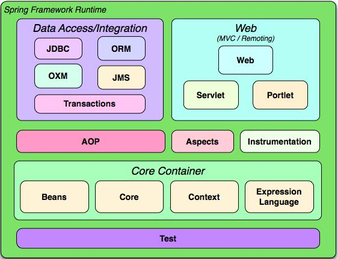

# Spring概述

## 1. 认识Spring

- Spring以一己之力撼动了JaveEE传统框架的基石
- 一站式轻量级开源框架
- 内核:IoC(Inverse of Control，控制反转)和AOP(Aspect Oriented Programming，面向切面编程)
- 提供了展现层：SpringMVC，持久层Spring JDBC，业务层事务管理。

## 2. 关于SpringSource

## 3. Spring带给我们什么

- EJB采用了很臃肿的框架，不仅造成了极为陡峭的学习曲线，而且给开发测试和部署都带来很大的困难
- Spring也提供了EJB一些很好的功能，例如声明事物，透明持久化等等，但是简化开发。

Spring给我们带来的好处
- 方便解耦，简化开发：用户不必为单例类，属性文件解析等编写的代码
- AOP编程支持
  - 声明式事物的支持
  - 方便测试:不依赖容器
  - 方便集成框架
  - 降低JavaEE API的使用难度
- 框架的源码写得很好

## 4. Spring体系结构

### 4.1 IoC

Spring核心模块实现了IoC功能，他把类和类之间的依赖从代码中脱离出来，用配置的方式进行依赖管理描述，由IoC容器负责依赖类之间的创建，拼接，管理获取等工作。BeanFactory接口是Spring框架的核心接口，提供了容器许多核心功能。

Contex模块在核心模块上面，扩展了BeanFactory的功能，还提供了很多企业级服务。ApplicationContext接口是Context模块的核心接口。

表达式语言模块是统一表达式语言的一个扩展。

### 4.2 AOP

AOP是一种编程思想，横切逻辑编程的思想，开拓了人们思考问题的思路。Spring提供了满足AOP Alliance规范的实现。

### 4.3 数据访问和集成

Spring站在Dao的抽象层面，建立了一套面向dao层统一的异常体系。其次，Spring通过模板化技术对各种数据访问技术进行了薄层的封装，把模块化的代码隐藏起来。这样Spring建立起和数据访问形式以及访问技术无关的统一的dao层，借助AOP技术，Spring提供了声明式事务的功能。

### 4.4 web及远程操作

该模块建立在ApplicationContext模块上面，提供了web应用的各种工具类。这里可以继承struts等MVC框架。

### 4.5 web及远程访问

Spring自己提供了完整的类似Struts的MVC框架被称为Spring MVC

## 5. Spring 3.0的新功能

- 核心API更新到Java5.0
- 提供了Spring表达式语言
- 可以通过Java类提供IoC配置信息
- 提供了类型转换系统和属性格式化系统
- 数据访问层新增OXM功能
- web层增强

## 6. Spring对Java的要求

## 7. 如何获取Spring

