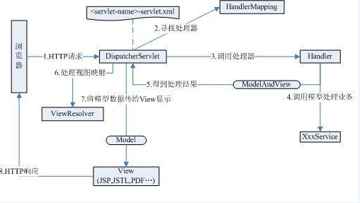

# Spring MVC

## 1. SpringMVC概述

SpringMVC围绕`DispatcherServlet`展开，它负责截获请求并将其分配给响应处理器处理。

### 1.1 体系结构



### 1.2 配置DispatcherServlet

和任何Servlet一样，用户需要在web.xml中配置DispatcherServlet。

要了解Spring MVC框架的工作原理，必须要了解下面三个问题

1. DispatcherServlet框架怎么截获特定的http请求，交由SpringMVC管理？
2. 位于Web层的Spring容器（WebApplicationContext）如何与位于业务层的Spring容器(ApplicationContext)建立关联，以使Web层的Bean调用业务层的Bean？
3. 如何初始化Spring MVC的各个部件，并将它们装配到DispatcherServlet中？

#### 1.2.1截获特定请求
```xml
 <!--申明一个Servlet-->
	<servlet>
        <servlet-name>baobaotao</servlet-name>
        <servlet-class>org.springframework.web.servlet.DispatcherServlet</servlet-class>
        <load-on-startup>2</load-on-startup>
    </servlet>
<!--名为DispatcherServlet的url模式-->
    <servlet-mapping>
        <servlet-name>baobaotao</servlet-name>
        <url-pattern>*.html</url-pattern>
    </servlet-mapping>
```

申明Servlet的时候，默认加载在/Web-INF/baobaotao-servlet.xml的Spring配置文件，启动web层的Spring容器

