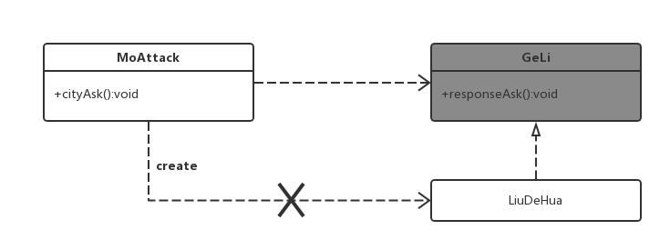
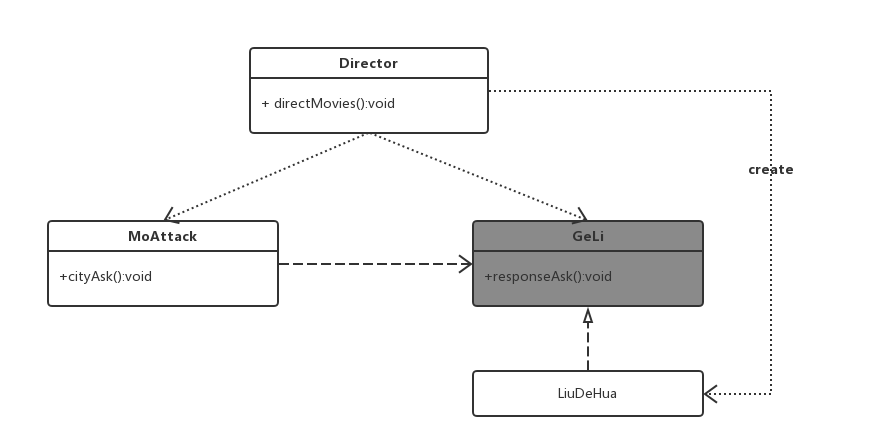
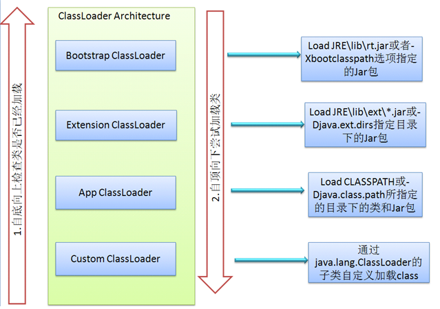

# IoC容器概述

## 1. IoC概述

> Spring容器的内核，AOP ,声明式事务的基础

### 1.1 实例理解

#### 1.1.1 直接侵入式

> Test->demo01

```java
    public void cityGateAsk(){
        LiuDeHua liuDeHua = new LiuDeHua();
        liuDeHua.responseAsj("墨者革离！");
    }
```

####1.1.2 接口分离式

> Test->demo02

```java
    public void cityGateAsk(){
        GeLi liuDeHua = new LiuDeHua();
        liuDeHua.responseAsk("墨者革离！");
    }
```



可以看出来，剧本还是要实例化一个`LiuDeHua`演员，也就是要依赖于一个实际的演员。而在现实当中，一个好的剧本是不会依赖演员的，它仅仅依赖角色（`GeLi`）。至于为演员选角，应该是**导演**做的事情。

真正好的设计应该是这样子，实现剧本和实际角色的真正分离



#### 1.1.3 IoC主要概念

IoC(Inverse of Control)，控制反转，在上面的例子中，“控制”是指`GeLi`角色的扮演者的选择权，反转是指，尽管这个角色是剧本使用的，但是选择权不在剧本手中，而是反转到导演手中。在软件领域中，**某一接口的具体实现类的选择权从接口的调用者手中移除，转交第三方决定，这就是控制反转。**

### 1.2 IoC的类型

#### 1.2.1 构造函数注入

> Test->demo03

```java
//剧本
public class MoAttack {
    private GeLi geLi;
    public MoAttack(GeLi geLi) {
        this.geLi = geLi;
    }
    public void cityGateAsk() {
        geLi.responseAsk("墨者革离！");
    }
}
//导演
public class Director {
    public void directMovies(){
        MoAttack moAttack = new MoAttack(new LiuDeHua());//导演来创建一个演员饰演革离角色
        moAttack.cityGateAsk();
    }
}
```

然而，尽管革离是墨攻的第一主角，但是并非每个场景都需要这个人物，也就是说在刚开始指导这个剧本时并不一定需要这个注入刘德华这个演员，这时候使用构造方法注入就不太适合。

#### 1.2.2 属性注入

> Test->demo04

```java
public class Director {
    public void directMovies(){
        MoAttack moAttack = new MoAttack();
        moAttack.setGeLi(new LiuDeHua());//通过属性注入，给改剧本的革离角色制定刘德华这个演员
        moAttack.cityGateAsk();
    }
}
```

#### 1.2.3 通过容器完成依赖关系注入

许多时候，一个制片人在选择某个剧本之后，希望通过第三方机构来选择导演，演员，让他们各司其职，而不是让导演拥有一家独大的权利，这时候剧本演员导演就实现解耦了。

所谓第三方机构在软件领域就是一个第三方的容器，它帮助完成类的初始化与装配工作，让开发者脱离这些无用的工作，把精力投入业务开发之中。

> Test->demo05

## 2. 相关Java知识

Java语言允许通过程序化的方式间接对class的对象实例操作，即“绕过”`new`关键字实例化对象。	这就是所谓Java反射机制。

### 2.1 实例理解

> Test->demo06

通过`new`关键字:

```java
        Car car = new Car("红旗","红色",200);
        System.out.println(car);
```

通过反射机制:

```java
        ClassLoader loader = Thread.currentThread().getContextClassLoader();
        Class clazz = loader.loadClass("com.demo06.Car");

        Constructor constructor = clazz.getDeclaredConstructor((Class[])null);
        Car car = (Car)constructor.newInstance();

        Method setBrand = clazz.getDeclaredMethod("setBrand",String.class);
        setBrand.invoke(car,"红旗");

        Method setColor = clazz.getDeclaredMethod("setColor",String.class);
        setColor.invoke(car,"黑色");

        Method setMaxSpeed = clazz.getDeclaredMethod("setMaxSpeed",int.class);
        setMaxSpeed.invoke(car,300);

        System.out.println(car);
        Assert.assertTrue(car!=null);
```

### 2.2 类装载器ClassLoader

> Test->demo07

参考Java代码的执行过程：[Java代码编译和执行的整个过程](http://blog.csdn.net/cutesource/article/details/5904542)

Java源码在经过编译成为字节码之后，进入虚拟机中。开始进行类装载步骤，这个步骤分为3步。

1. 装载：查找和导入class文件
2. 链接：执行校验，准备和解析步骤，其中解析是可以选择的
   1. 校验：检验导入class文件数据的正确性
   2. 准备：给静态变量分配空间
   3. 解析：将符号引用转换成直接引用
3. 初始化：对类的静态变量，静态代码块执行初始化工作。

其中重点要说的装载步骤可以用下图表示



装载过程由classloader类及其子类负责。JVM在运行时会产生3个classloader，bootstrap classloader,extension classloader, app classloader。它们的关系如上图所示，值得注意的是，bootstrap classloader是一个C++类，Java语言不可以获得其句柄。加载过程自上而下尝试加载，因为防止有人编写基础类导致Java语言崩溃。

```java
ClassLoader classLoader = Thread.currentThread().getContextClassLoader();
System.out.println(classLoader);
System.out.println(classLoader.getParent());
System.out.println(classLoader.getParent().getParent());

sun.misc.Launcher$AppClassLoader@12a3a380
sun.misc.Launcher$ExtClassLoader@511d50c0
null
```

除了JVM默认的三个默认的classloader之外，也可以自己编写第三方的类装载器，以实现自己的需求。

类文件在装载之后，在虚拟机会有一个`java.lang.class`类描述对象。这个类的所有实例都有这个类描述对象的引用（`getClass`），而每个类描述对象又有其装载器的引用（`getClassLoader`）。

### 2.3 Java反射机制

JVM的装载器原理决定了其反射机制，即可以用编程手段在class对象中获取其构造函数，成员变量和方法。主要是三个反射类：

- Constructor：类的构造函数反射类，`getConstructors`可以获得class所有构造函数的反射对象数组。主要方法`newInstance`实例化一个对象。
- Method：类的方法反射类，`getMethod`可以获得class所有方法反射对象数组。主要方法`invoke`执行方法。
- Field：类的成员变量的反射类，`getDeclaredFields`可以获得类的成员变量反射的对象数组。主要方法是`set`

在JVM没有设置安全机制时，使用以上几个反射类甚至可以访问私有成员变量和私有方法。需要使用（`setAcessible`）

## 3. 资源访问

### 3.1 资源抽象接口

> Test->demo08

Spring对JDK提供的资源访问类（`URL,File`）等做了一些薄层封装，使其更易于使用。

核心接口：`Resource`。Spring将使用Resource加载各种资源，包括各类配置文件，其具体实现类包括以下。

- ByteArrayResource：二进制数组保存的资源，一般都在内存里通过程序构造。
- ClassPathResource：类路径下的资源（这里注意maven下的ClassPathResource是Resource目录）
- FileSystemResource：文件系统资源
- InputStreamResource：输入流资源
- ServletContextResource：访问web容器上下文
- UrlResource：访问任何可以通过URL访问的资源

注意以上Resource接口可以在不使用Spring的情况下使用

```java
    public static void main(String[] args) {
        Resource resource1 = new FileSystemResource("E:/Git/notes/Spring3.x/projects" +
                "/Test/src/resource/applicationContext.xml");
        Resource resource2 = new ClassPathResource("applicationContext");

        try {
            InputStream is = resource1.getInputStream();
            System.out.println(convertStreamToString(is));
            is.close();
        } catch (IOException e) {
            e.printStackTrace();
        }
    }
//maven项目，applicationContext在src/resource目录下
```

### 3.2 资源加载

Spring也可以在不显式使用`Resource`实现类的情况下，仅通过资源地址符号加载资源。资源地址符号包括

- classpath:从类路径中加载（maven中从Resource目录里加载）
- file:文件系统中加载
- http:// web服务器中加载
- ftp://ftp服务器中加载

Spring中使用`ResourceLoader`的实现类`ResourcePatternResolver`来实现以上的加载资源。

```java
    public static void main(String[] args) throws Throwable {
        ResourcePatternResolver resolver = new PathMatchingResourcePatternResolver();
        Resource[] resources = resolver.getResources("classpath:*.txt");
        System.out.println(resources.length);
        for (Resource resource:resources){
            System.out.println(resource.getDescription());
        }
    }
//可以找到classpath下所有txt后缀的资源
```

## 4. BeanFactory和ApplicationContext

Spring通过一个配置文件描述Bean和Bean之间的关系，利用反射功能实例化Bean并建立Bean之间联系。Spring的IoC容器在完成这些底层工作的基础上，提供了Java bean生命周期等等的管理。

Bean工厂是Spring框架最核心的接口，面向Spring本身。应用上下文（ApplicationContext）建立在Bean工厂之上，更多的面向应用。

### 4.1 BeanFactory介绍

通用的类工厂，可以创建并管理各种类的对象，这些对象被称为bean。

#### 4.1.1类体系结构

BeanFactory主要的方法是`getBean`，其他各个接口和类扩展了BeanFactory，在继承链的底部，是我们最常使用的`XmlBeanFactory`

#### 4.1.2 初始化BeanFactory

> Test->demo10

XmlBeanFactory通过Resource装载Spring配置信息并启动IoC容器，然后通过getBean方法从IoC容器中获得bean。通过BeanFactory启动IoC容器时，并不会初始化容器定义的bean，初始化发生在第一次调用的时候。对于单例的bean来说，BeanFactory会缓存bean实例，在第二次调用getBean的时候从缓存中调用bean实例(使用了hashmap原理的缓存器)。

```java
        ResourcePatternResolver resolver = new PathMatchingResourcePatternResolver();
        Resource res = resolver.getResource("classpath:bean1.xml");
        BeanFactory xmlBeanFactory = new XmlBeanFactory(res);

        Car car = xmlBeanFactory.getBean("car1", Car.class);
        System.out.println(car);
```

### 4.2 ApplicationContext介绍

#### 4.2.1 ApplicationContext类体系结构

ApplicationContext类也继承自BeanFactory，通过多重继承之后，我们最终使用的是`AbstractXmlApplication`及其子类。

#### 4.2.2初始化ApplicationContext

> Test->demo10

和BeanFactory类似。然而在使用ApplicationContext获取IoC容器的时候，在获取容器时，容器会自动初始化所有单例的对象，并将其存入缓存器中。

```java
        ApplicationContext context = new ClassPathXmlApplicationContext("bean1.xml");
        Car car = context.getBean("car1",Car.class);
        System.out.println(car);
```

Spring3.0支持使用注释来进行配置，稍后会详解。

#### 4.2.3 WebApplicationContext类体系结构

WebApplicationContext专门为web应用设计，其扩展了ApplicationContext的方法。Spring的应用上下文和web容器的上下文可以实现互相访问。

#### 4.2.4 WebApplicationContext的初始化

WebApplicationContext需要有ServletContext才能初始化，这一点和BeanFactory和ApplicationContext有所区别。

```xml
<!-制定配置文件->
<context-param>
  <param-name>contextConfigLocation</param-name>
  <param-value>
  	/WEB-INF/baobaotao-dao.xml,/WEB-INF/baobaotao-service.xml
  </param-value>
</context-param>

<!-声明Web容器监听器->
<listener>
  <listener-class>org.springframework.web.context.ContextLoaderListener</listener-class>
</listener>
```

ContextLoaderListener通过web容器上下文参数contextConfigLocation获取Spring配置文件位置。

### 4.3 父子容器

Spring的IoC容器可以建立父子层级的容器体系，子容器可以访问父容器的Bean，但是不能反向访问。

## 5. Bean生命周期

### 5.1 BeanFactory生命周期

1. 调用者getBean时，如果容器注册`org.springframework.beans.factory.config. InstantitationAwareBeanPostProcessor`，在实例化bean之前，会调用`postProcessBeforeInstantiation`
2. 根据配置情况调用构造函数或者工厂化方法实例Bean
3. 如果容器注册`InstantitationAwareBeanPostProcessor`接口，此时调用`postProcessAfterInstantiation`
4. 如果Bean配置了属性信息，容器在这一步把配置值放在实例好的Bean中，不过在每个属性值设置之前，先调用`InstantitationAwareBeanPostProcessor`中的`postProcessPropertyValues`方法。
5. 调用Bean的属性设置方法设置属性值
6. 如果Bean注册了`org.springframework.beans.factory.BeanNameAware`接口，将调用`setBeanName`方法将配置文件中的Bean对应名称设置到bean中去。
7. 如果Bean注册了`org.springframework.beans.factory.BeanFactoryAware`接口，将调用`setBeanFactory`方法把BeanFactory容器实例设置到Bean中去。
8. 如果BeanFactory装配了`org.springframework.beans.factory.BeanPostProcessor`后处理器，此时调用`postProcessBeforeInitialization`接口方法进行加工操作。这里可以对某些bean进行特殊处理，甚至改变bean的行为，许多功能例如AOP，动态代理都是在这里实现的。
9. 如果Bean注册了`InitializingBean`接口，将调用接口中的`afterPropertiesSet`方法。
10. 如果Bean中通过init-method指定了初始化方法，此时调用
11. `BeanPostProcessor`中指定的`postProcessAfterInitialization`将在此执行，容器获得再次加工Bean的机会
12. 如果Bean指定作用范围是prototype，此时bean调用权交还调用者，Spring将不再过问。如果Bean指定的作用范围是singleton，spring容器还需要对其进行进一步管理。
13. 如果Bean实现了`DisposableBean`接口，将调用接口的`afterPropertiesSet`方法。
14. 如果bean指定了destroy-method，Spring将执行这个方法完成资源的释放。

大体上，生命周期中的各个方法分为3类

- Bean自身的方法
- Bean级生命周期接口方法：解决个性问题
- 容器级生命周期接口方法：`InstantitationAwareBeanPostProcessor`和`BeanPostProcessor`指定的四个方法，一般独立于bean，解决共性问题。

### 5.2 实例

> Test->demo11

### 5.3 探讨

一般说来，开发者（并非Spring框架或者Spring插件的开发者）并不需要关注Bean的注册的那几个接口，比如`BeanNamAWare`如果需要使用BeanName直接将其作为属性注入即可。注册接口也将Bean和Spring框架联系的过于紧密。这并非Spring框架的目的。然而对于Spring框架本身，`BeanPostProcessor`接口可以像插件一样注册到容器里面，给所有的bean带来共性，Spring的AOP功能就是基于此的。

### 5.4 ApplicationContext的生命周期

类似于BeanFactory的生命周期，些许不同。但是配置变简单了，不用手动为容器`addBeanPostProcessor`，可以在配置中完成，因此我们常常使用ApplicationContext


