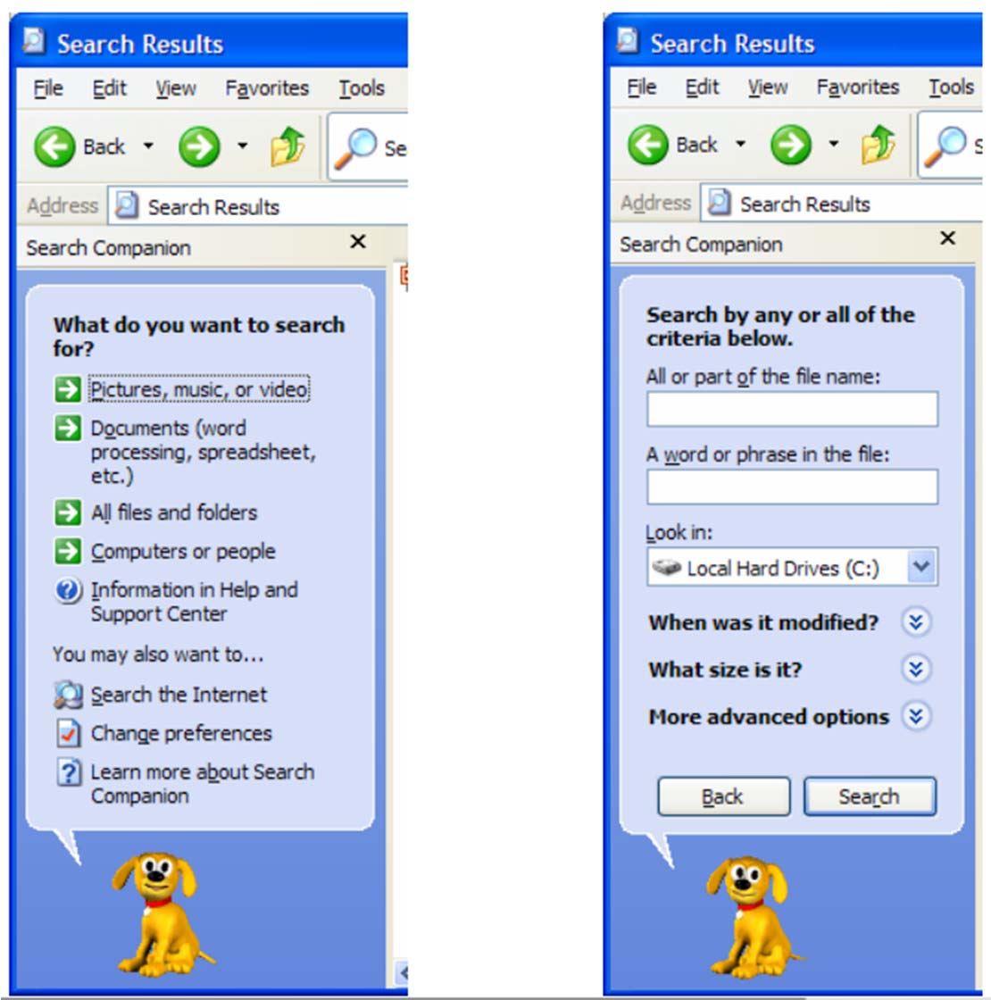
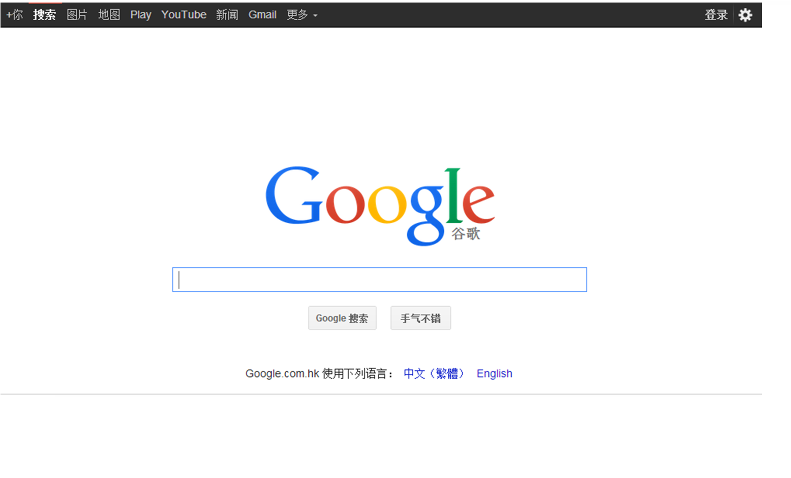

# 评估的基础知识

## 1 几个例子

### 1.1 windows搜索功能

前者不仅用户体验差，并且还暴露了一些内部的实现细节。

### 1.2 Google界面

减少超链接使得界面简介

### 1.3 12306订票页面

算了不忍吐槽

### 1.4 京东售后

不合适的输入框吸引了使用者的注意力

## 2 背景

- 评估是很有必要的，即使现在的系统也由很多问题
- 什么是评估
  - 系统的数据搜集过程
  - 了解用户在特定环境中使用产品执行任务的情况

## 3 评估目标 

- 评估系统功能的范围和可达性
- 评估交互中用户的体验
- 确定系统中的某些特定问题

## 4 评估原则

- 评估应该依赖用户
- 评估不是一个单独的过程
- 评估应该放在真实的工作环境下执行
- 要选择广泛代表的用户

## 5 评估泛型

### 5.1 快速评估

- 设计人员非正式地向用户或顾问了解反馈信息,以证实设计构思是否符合用户需要
- 基本特征：快速

### 5.2 可用性测试

- 20世纪80年代的主导方法
- 评测典型用户执行典型任务时的情况
  -  包括用户出错次数、完成任务的时间等
- 基本特征
  - 是在评估人员的密切控制之下实行的
- 主要任务
  - 量化表示用户的执行情况
- 缺点
  - 测试用户的数量通常较少
  - 不适合进行细致的统计分析

### 5.3 实地研究

- 基本特征

  - 在自然工作环境中进行
- 目的

  - 理解用户的实际工作情形以及技术对他们的影响
- 作用

  - 探索新技术的应用契机
  - 确定产品的需求
  - 促进技术的引入
  - 评估技术的应用
- 分类
  - 评测人员作为“局外人”
  - 评测人员也可作为“局内人”或测试用户

### 5.4 预测性评估

- 专家们根据自己对典型用户的了解(通常使用启发式过程)预测可用性问题
  - 也可使用理论模型
- 基本特征
  - 用户可以不在场
  - 使得整个过程快速、成本较低
- 启发式评估是典型的预测性评估方法
  - 注意:启发式原则应定制
  - 可能误导设计人员
- 且有些结果可能并不准确

## 6 评估技术

- 观察法：观察用户的行为得到评估结论（不一定能够得到所有结论）
- 询问用户意见：询问对象从几个到几百个都可以
- 询问专家意见：专家有时可以提供解决方案
- 用户测试：通常在受控环境中进行
- 基于模型和理论进行预测
- 常用组合：启发式评估+用户测试；访谈+问卷

## 7 评估步骤

六个步骤

1. 确定目标
2. 发掘问题
3. 选择评估泛型和技术
4. 明确实际问题
5. 处理道德问题
6. 评估解释并表示数据

正式实验之前，对评估计划做多次的小范围测试

评估结束之后，需要对可用性问题进行分级，为了避免偏差，应该综合多个评价者的意见。